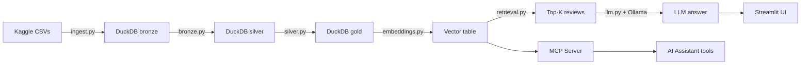

# Sephora RAG — Complete Project Guide

Build a local RAG system from scratch: Kaggle data → DuckDB vector search → Ollama LLM → Streamlit UI → MCP server.

---

## Architecture



---

## Final File Structure

```
duck_rag/
├── pyproject.toml             # project deps (uv or pip)
├── .env.example               # env var template
├── .python-version            # pin Python version
├── README.md
├── PROJECT_GUIDE.md           # this file
│
├── data/
│   └── source/                # raw CSVs (gitignored)
│       ├── product_info.csv
│       └── reviews_*.csv
│
├── notebooks/
│   └── exploration.ipynb      # original pipeline notebook (keep for reference)
│
├── sephora_rag/               # core library — pure logic, no framework
│   ├── __init__.py
│   ├── config.py              # all paths and constants
│   ├── ingest.py              # download_dataset() via kagglehub
│   ├── db/
│   │   ├── __init__.py
│   │   ├── bronze.py          # raw CSV → DuckDB tables
│   │   ├── silver.py          # type casting / cleaning
│   │   └── gold.py            # filtered subset for RAG
│   ├── embeddings.py          # model loading, UDF, vector table creation
│   ├── retrieval.py           # query_rag() — pure vector retrieval, no LLM
│   └── llm.py                 # Ollama client + RAG prompt builder
│
├── app/
│   └── streamlit_app.py       # Streamlit chat UI
│
├── mcp_server/
│   └── server.py              # MCP server exposing RAG as a tool
│
└── pipeline.py                # ETL entry point — run once to build the DB
```

---

## Prerequisites

```bash
# Python ≥ 3.11, uv recommended
uv venv && source .venv/bin/activate

# Ollama (local LLM runtime)
# Install from https://ollama.com then pull a model:
ollama pull llama3.2        # ~2 GB, fast on CPU
# or: ollama pull mistral, phi3, gemma2:2b

# Kaggle credentials for data download
# Set KAGGLE_USERNAME and KAGGLE_KEY env vars (see .env.example)
```

---

## Phase 1 — Project Setup

### `pyproject.toml`

```toml
[project]
name = "sephora-rag"
version = "0.1.0"
description = "Local RAG over Sephora reviews — DuckDB + Ollama + Streamlit + MCP"
readme = "README.md"
requires-python = ">=3.11"
dependencies = [
    "duckdb>=1.2.0",
    "kagglehub>=0.3.0",
    "sentence-transformers>=3.0.0",
    "numpy>=1.26.0",
    "pandas>=2.2.0",
    "ollama>=0.3.0",
    "streamlit>=1.35.0",
    "mcp[cli]>=1.0.0",
    "python-dotenv>=1.0.0",
]

[project.scripts]
pipeline = "pipeline:main"

[build-system]
requires = ["hatchling"]
build-backend = "hatchling.build"
```

```bash
pip install -e .
# or with uv:
uv sync
```

### `.env.example`

```dotenv
# Copy to .env and fill in values
KAGGLE_USERNAME=your_username
KAGGLE_KEY=your_api_key

OLLAMA_MODEL=llama3.2
OLLAMA_HOST=http://localhost:11434

DB_PATH=data/sephora.duckdb
EMBED_MODEL=all-MiniLM-L6-v2
EMBED_DIM=384
```

### `.gitignore` additions

```
.env
data/source/
data/*.duckdb
.venv/
__pycache__/
```

---

## Design Decisions

### Why embeddings are not part of the gold layer

Gold answers **what data** to use (business/filtering logic). Embeddings answer **how to search** it (ML artifact).

They have different reasons to change:

| Change | Affects |
|---|---|
| Filter reviews with > 50 words | Gold only — re-run `gold.py` |
| Swap embedding model (`MiniLM` → `mxbai-embed-large`) | Embeddings only — re-run `embeddings.py` |

The notebook already demonstrates this: two embedding models (`reviews_test_rag` dim=384, `reviews_test_rag2` dim=1024) were tested on the same gold data without touching the gold query. Embeddings are closer to a **serving-layer index** than a data transformation — analogous to a database index you rebuild when the representation changes.

### What columns belong in the gold table

Gold should contain only what retrieval and the LLM actually need. Drop everything else — every column you keep ends up in the LLM context window.

**Keep:**
```
review_id, product_id, product_name, rating, is_recommended, review_title, review_text
```

**Drop** (noisy, not used in prompts or filters): `helpfulness`, `submission_time`, `skin_type`, etc.

### How to name embedded columns

**Do not encode the model name in the column name** (e.g. `review_text_minilm_embedding`). That couples the schema to a specific model — every swap requires a schema migration.

**Instead, use a generic name and drive the model from config:**

```python
# config.py — change model here, column name stays the same everywhere
EMBED_MODEL = "all-MiniLM-L6-v2"
EMBED_DIM   = 384
```

```sql
-- always called text_embedding regardless of which model produced it
embed_text(review_text)::FLOAT[{EMBED_DIM}] AS text_embedding
```

When you swap models, update `EMBED_MODEL`/`EMBED_DIM` in `.env` and re-run `pipeline.py`. Schema stays stable.

**When a lookup table makes sense:** only if you want multiple embeddings coexisting (e.g. benchmarking two models). For a single-model project it is over-engineering.

```sql
-- reviews_embeddings lookup (only if benchmarking multiple models)
CREATE TABLE reviews_embeddings (
    review_id   VARCHAR,
    model_name  VARCHAR,   -- 'all-MiniLM-L6-v2'
    dim         INTEGER,   -- 384
    embedding   FLOAT[],
    PRIMARY KEY (review_id, model_name)
);
```

---

## Phase 2 — ETL Pipeline

### `sephora_rag/config.py`

Single source of truth for all paths and constants. Import from here everywhere else.

```python
import os
from pathlib import Path
from dotenv import load_dotenv

load_dotenv()

# Directories
DIR_ROOT = Path(__file__).parent.parent
DIR_DATA = DIR_ROOT / "data"
DIR_SOURCE = DIR_DATA / "source"

# Files
FILE_DB = Path(os.getenv("DB_PATH", DIR_DATA / "sephora.duckdb"))
FILE_PRODUCTS = DIR_SOURCE / "product_info.csv"
FILES_REVIEWS = str(DIR_SOURCE / "reviews*.csv")

# Embedding models
EMBED_MODEL = os.getenv("EMBED_MODEL", "all-MiniLM-L6-v2")
EMBED_DIM = int(os.getenv("EMBED_DIM", 384))

# LLM
OLLAMA_MODEL = os.getenv("OLLAMA_MODEL", "llama3.2")
OLLAMA_HOST = os.getenv("OLLAMA_HOST", "http://localhost:11434")
```

### `sephora_rag/ingest.py`

```python
import os
import kagglehub
from sephora_rag.config import DIR_SOURCE

DATASET = "nadyinky/sephora-products-and-skincare-reviews"


def download_dataset() -> None:
    """Download Sephora dataset from Kaggle if source dir is empty."""
    os.makedirs(DIR_SOURCE, exist_ok=True)
    if not any(DIR_SOURCE.iterdir()):
        print("Downloading dataset from Kaggle...")
        kagglehub.dataset_download(DATASET, output_dir=DIR_SOURCE)
        print(f"Downloaded to {DIR_SOURCE}")
    else:
        print(f"Source data already present in {DIR_SOURCE}, skipping download.")
```

### `sephora_rag/db/bronze.py`

Loads raw CSVs into DuckDB as-is — no transformations, just ingestion.

```python
import duckdb
from sephora_rag.config import FILE_PRODUCTS, FILES_REVIEWS


def create_tables(con: duckdb.DuckDBPyConnection) -> None:
    """Ingest raw CSVs into bronze tables (no type casting)."""
    print("Creating bronze tables...")
    con.execute(f"""
        CREATE OR REPLACE TABLE bronze_products AS
            SELECT *
            FROM read_csv('{FILE_PRODUCTS}', header=true, delim=',');

        CREATE OR REPLACE TABLE bronze_reviews AS
            SELECT *
            FROM read_csv('{FILES_REVIEWS}', header=true, delim=',');
    """)
    n_products = con.execute("SELECT count(*) FROM bronze_products").fetchone()[0]
    n_reviews = con.execute("SELECT count(*) FROM bronze_reviews").fetchone()[0]
    print(f"  bronze_products: {n_products:,} rows")
    print(f"  bronze_reviews:  {n_reviews:,} rows")
```

### `sephora_rag/db/silver.py`

Type casting, cleaning, and array parsing. Mirrors the notebook transformations exactly.

```python
import duckdb


def create_tables(con: duckdb.DuckDBPyConnection) -> None:
    """Cast types and clean data into silver tables."""
    print("Creating silver tables...")
    con.execute("""
        CREATE OR REPLACE TABLE silver_products AS
            SELECT
                * EXCLUDE (
                    limited_edition, new, online_only,
                    out_of_stock, sephora_exclusive,
                    ingredients, highlights
                ),
                CAST(limited_edition  AS BOOLEAN) AS limited_edition,
                CAST(new              AS BOOLEAN) AS new,
                CAST(online_only      AS BOOLEAN) AS online_only,
                CAST(out_of_stock     AS BOOLEAN) AS out_of_stock,
                CAST(sephora_exclusive AS BOOLEAN) AS sephora_exclusive,
                string_split(
                    trim(replace(highlights, $$'$$, ''), '[]'), ', '
                ) AS highlights,
                string_split(
                    trim(replace(ingredients, $$'$$, ''), '[]'), ', '
                ) AS ingredients
            FROM bronze_products;

        CREATE OR REPLACE TABLE silver_reviews AS
            SELECT
                column00 AS review_id,
                * EXCLUDE (is_recommended),
                CAST(is_recommended AS BOOLEAN) AS is_recommended
            FROM bronze_reviews;
    """)
    print("  silver_products and silver_reviews created.")
```

### `sephora_rag/db/gold.py`

Filters to a focused subset for RAG: one product with polarised reviews (mix of high and low ratings, limited count for fast demo).

```python
import duckdb


def create_tables(con: duckdb.DuckDBPyConnection) -> None:
    """Create gold RAG table: one product with polarised, countable reviews."""
    print("Creating gold table...")
    con.execute("""
        CREATE OR REPLACE TABLE gold_reviews AS
            WITH product_review_stats AS (
                SELECT
                    product_id,
                    count(*)        AS num_reviews,
                    min(rating)     AS min_rating,
                    max(rating)     AS max_rating,
                    avg(rating)     AS avg_rating
                FROM silver_reviews
                GROUP BY product_id
                HAVING (
                    count(*)    BETWEEN 25 AND 30
                    AND min(rating) < 2
                    AND max(rating) > 4
                )
                ORDER BY abs(avg_rating - 2.5) ASC
                LIMIT 1
            )
            SELECT
                r.review_id,
                r.product_id,
                r.product_name,
                r.rating,
                r.is_recommended,
                r.review_title,
                r.review_text
            FROM silver_reviews r
            JOIN product_review_stats s ON r.product_id = s.product_id;
    """)
    n = con.execute("SELECT count(*) FROM gold_reviews").fetchone()[0]
    print(f"  gold_reviews: {n} rows")
```

### `sephora_rag/embeddings.py`

Registers an embedding UDF in DuckDB and builds the vector table with HNSW index.

```python
import duckdb
from sentence_transformers import SentenceTransformer
from sephora_rag.config import EMBED_MODEL, EMBED_DIM

_model: SentenceTransformer | None = None


def get_model() -> SentenceTransformer:
    global _model
    if _model is None:
        print(f"Loading embedding model: {EMBED_MODEL}")
        _model = SentenceTransformer(EMBED_MODEL, device="cpu")
    return _model


def embed_text(text: str) -> list[float]:
    return get_model().encode(text).tolist()


def register_udf(con: duckdb.DuckDBPyConnection) -> None:
    """Register embed_text as a DuckDB UDF (idempotent)."""
    try:
        con.create_function("embed_text", embed_text, [str], list[float])
    except duckdb.InvalidInputException:
        pass  # already registered


def create_vector_table(con: duckdb.DuckDBPyConnection) -> None:
    """Embed review text and build HNSW index on the vector column."""
    print("Creating vector table and HNSW index...")
    register_udf(con)
    con.execute(f"""
        INSTALL vss;
        LOAD vss;
        SET hnsw_enable_experimental_persistence = TRUE;

        CREATE OR REPLACE TABLE reviews_rag AS
            SELECT
                *,
                embed_text(review_title)::FLOAT[{EMBED_DIM}] AS title_embedding,
                embed_text(review_text)::FLOAT[{EMBED_DIM}]  AS text_embedding
            FROM gold_reviews;

        CREATE INDEX IF NOT EXISTS idx_text_hnsw
            ON reviews_rag USING HNSW (text_embedding);
    """)
    n = con.execute("SELECT count(*) FROM reviews_rag").fetchone()[0]
    print(f"  reviews_rag: {n} rows with embeddings and HNSW index")
```

### `sephora_rag/retrieval.py`

Pure vector retrieval — no LLM, no side effects.

```python
import duckdb
from sephora_rag.config import EMBED_DIM
from sephora_rag.embeddings import embed_text, register_udf


def query_rag(
    con: duckdb.DuckDBPyConnection,
    question: str,
    k: int = 5,
) -> list[dict]:
    """Return the k most semantically similar reviews to `question`."""
    register_udf(con)
    embedding = embed_text(question)
    rows = con.execute(
        f"""
        SELECT
            review_id,
            product_name,
            rating,
            is_recommended,
            review_title,
            review_text
        FROM reviews_rag
        ORDER BY array_distance(text_embedding, ?::FLOAT[{EMBED_DIM}]) ASC
        LIMIT {k};
        """,
        [embedding],
    ).fetchall()

    columns = ["review_id", "product_name", "rating", "is_recommended", "review_title", "review_text"]
    return [dict(zip(columns, row)) for row in rows]
```

### `sephora_rag/llm.py`

Builds context from retrieved reviews and calls Ollama.

```python
import ollama
import duckdb
from sephora_rag.config import OLLAMA_MODEL, OLLAMA_HOST
from sephora_rag.retrieval import query_rag

SYSTEM_PROMPT = """You are a Sephora skincare assistant.
Answer questions using ONLY the customer reviews provided as context.
If the reviews don't contain enough information to answer, say so clearly.
Be concise and cite specific reviews when relevant."""


def build_context(reviews: list[dict]) -> str:
    lines = []
    for i, r in enumerate(reviews, 1):
        rec = "recommended" if r["is_recommended"] else "not recommended"
        lines.append(
            f"Review {i} (rating {r['rating']}/5, {rec}):\n"
            f"  Title: {r['review_title']}\n"
            f"  Text:  {r['review_text']}"
        )
    return "\n\n".join(lines)


def ask(
    con: duckdb.DuckDBPyConnection,
    question: str,
    model: str = OLLAMA_MODEL,
    k: int = 5,
) -> tuple[str, list[dict]]:
    """
    Returns (llm_answer, retrieved_reviews).
    Returning reviews lets the UI show sources.
    """
    reviews = query_rag(con, question, k=k)
    context = build_context(reviews)

    client = ollama.Client(host=OLLAMA_HOST)
    response = client.chat(
        model=model,
        messages=[
            {"role": "system", "content": SYSTEM_PROMPT},
            {"role": "user", "content": f"Context:\n{context}\n\nQuestion: {question}"},
        ],
    )
    return response["message"]["content"], reviews
```

### `pipeline.py`

Entry point — run once to build the full database.

```python
import duckdb
from sephora_rag.config import FILE_DB
from sephora_rag import ingest
from sephora_rag.db import bronze, silver, gold
from sephora_rag import embeddings


def main() -> None:
    ingest.download_dataset()

    con = duckdb.connect(FILE_DB)
    try:
        bronze.create_tables(con)
        silver.create_tables(con)
        gold.create_tables(con)
        embeddings.create_vector_table(con)
    finally:
        con.close()

    print(f"\nDone. Database written to {FILE_DB}")


if __name__ == "__main__":
    main()
```

```bash
python pipeline.py
```

---

## Phase 3 — Streamlit App

### `app/streamlit_app.py`

```python
import streamlit as st
import duckdb
from sephora_rag.config import FILE_DB, OLLAMA_MODEL
from sephora_rag.llm import ask
from sephora_rag.embeddings import register_udf

st.set_page_config(page_title="Sephora Review RAG", page_icon="💄", layout="wide")
st.title("💄 Sephora Review Assistant")
st.caption("Ask questions — answered with real customer reviews via local LLM.")


@st.cache_resource
def get_connection() -> duckdb.DuckDBPyConnection:
    con = duckdb.connect(FILE_DB, read_only=True)
    register_udf(con)
    return con


con = get_connection()

# Sidebar — settings
with st.sidebar:
    st.header("Settings")
    model = st.selectbox(
        "Ollama model",
        ["llama3.2", "mistral", "phi3", "gemma2:2b"],
        index=0,
    )
    k = st.slider("Reviews to retrieve (k)", min_value=3, max_value=15, value=5)
    st.divider()
    st.info(
        "Runs fully locally — no data leaves your machine.\n\n"
        "Make sure Ollama is running: `ollama serve`"
    )

# Main — question input
question = st.text_input(
    "Your question",
    placeholder="Is this product good for sensitive skin?",
)

if st.button("Ask", type="primary", disabled=not question):
    with st.spinner("Retrieving reviews and generating answer..."):
        try:
            answer, reviews = ask(con, question, model=model, k=k)
        except Exception as e:
            st.error(f"Error: {e}")
            st.stop()

    # Answer
    st.subheader("Answer")
    st.write(answer)

    # Sources
    with st.expander(f"Sources — {len(reviews)} reviews retrieved", expanded=False):
        for r in reviews:
            stars = "⭐" * int(r["rating"])
            rec = "✅ Recommended" if r["is_recommended"] else "❌ Not recommended"
            st.markdown(f"**{r['review_title']}** — {stars} {rec}")
            st.write(r["review_text"])
            st.divider()
```

```bash
streamlit run app/streamlit_app.py
```

---

## Phase 4 — MCP Server

MCP (Model Context Protocol) exposes your RAG as a callable tool to any MCP-compatible AI assistant (Claude Desktop, VS Code Copilot, etc.).

### `mcp_server/server.py`

```python
from mcp.server.fastmcp import FastMCP
import duckdb
from sephora_rag.config import FILE_DB, OLLAMA_MODEL
from sephora_rag.embeddings import register_udf
from sephora_rag.retrieval import query_rag
from sephora_rag.llm import ask

mcp = FastMCP("Sephora RAG")

# Shared read-only connection
_con: duckdb.DuckDBPyConnection | None = None


def get_con() -> duckdb.DuckDBPyConnection:
    global _con
    if _con is None:
        _con = duckdb.connect(FILE_DB, read_only=True)
        register_udf(_con)
    return _con


@mcp.tool()
def ask_reviews(question: str) -> str:
    """
    Answer questions about Sephora skincare products using real customer reviews.
    Uses semantic search to find the most relevant reviews, then an LLM to answer.

    Args:
        question: A natural language question about the product or reviews.

    Returns:
        An answer grounded in customer reviews.
    """
    answer, _ = ask(get_con(), question)
    return answer


@mcp.tool()
def search_reviews(question: str, k: int = 5) -> list[dict]:
    """
    Retrieve the most semantically similar customer reviews to a question.
    Returns raw reviews without LLM synthesis — useful for exploration.

    Args:
        question: A natural language query.
        k: Number of reviews to return (default 5, max 15).

    Returns:
        List of review dicts with fields: review_id, product_name, rating,
        is_recommended, review_title, review_text.
    """
    k = min(k, 15)
    return query_rag(get_con(), question, k=k)
```

### Running the MCP server

```bash
# Run the server (stdio transport — default for MCP)
mcp run mcp_server/server.py

# Or install as a persistent MCP server in Claude Desktop:
# Add to ~/Library/Application Support/Claude/claude_desktop_config.json (macOS)
# or %APPDATA%/Claude/claude_desktop_config.json (Windows):
```

```json
{
  "mcpServers": {
    "sephora-rag": {
      "command": "python",
      "args": ["-m", "mcp", "run", "/absolute/path/to/mcp_server/server.py"],
      "cwd": "/absolute/path/to/duck_rag"
    }
  }
}
```

### Registering with VS Code Copilot

Add to your VS Code `settings.json`:

```json
"mcp": {
  "servers": {
    "sephora-rag": {
      "type": "stdio",
      "command": "python",
      "args": ["-m", "mcp", "run", "mcp_server/server.py"],
      "cwd": "${workspaceFolder}"
    }
  }
}
```

---

## Running Everything

```bash
# 1. Build the database (run once)
python pipeline.py

# 2. Start Ollama (separate terminal)
ollama serve

# 3. Launch Streamlit UI
streamlit run app/streamlit_app.py

# 4. Launch MCP server (separate terminal, for AI assistant integration)
mcp run mcp_server/server.py
```

---

## Suggested Git Commit Sequence

Each commit leaves the repo in a working, runnable state — this tells a story in `git log`.

```bash
git init
git add pyproject.toml .env.example .gitignore .python-version
git commit -m "chore: project scaffold"

git add notebooks/
git commit -m "feat: exploration notebook with full pipeline"

git add sephora_rag/config.py sephora_rag/__init__.py sephora_rag/ingest.py
git add sephora_rag/db/
git add pipeline.py
git commit -m "feat: ETL pipeline — bronze/silver/gold medallion layers"

git add sephora_rag/embeddings.py sephora_rag/retrieval.py
git commit -m "feat: sentence-transformers embeddings and DuckDB VSS vector search"

git add sephora_rag/llm.py
git commit -m "feat: Ollama LLM integration with RAG prompt builder"

git add app/
git commit -m "feat: Streamlit chat UI with source review display"

git add mcp_server/
git commit -m "feat: MCP server exposing ask_reviews and search_reviews tools"

git add README.md PROJECT_GUIDE.md
git commit -m "docs: architecture diagram, setup instructions, usage guide"
```

---

## `sephora_rag/__init__.py`

```python
# Expose the public API at package level
from sephora_rag.retrieval import query_rag
from sephora_rag.llm import ask

__all__ = ["query_rag", "ask"]
```

## `sephora_rag/db/__init__.py`

```python
# Empty — marks the directory as a Python package
```

---

## Portfolio Checklist

| Signal | Done when |
|---|---|
| Medallion architecture (bronze/silver/gold) | `db/` module has all three layers |
| Vector DB without heavyweight infra | DuckDB VSS + HNSW index |
| Local LLM (no OpenAI key needed) | Ollama integration in `llm.py` |
| Clean entry point | `python pipeline.py` runs end-to-end |
| Interactive UI | `streamlit run app/streamlit_app.py` |
| MCP tool integration | `mcp run mcp_server/server.py` |
| Reproducible install | `pip install -e .` or `uv sync` |
| Clean git history | One commit per feature phase |
| Architecture diagram | Mermaid diagram in README |
